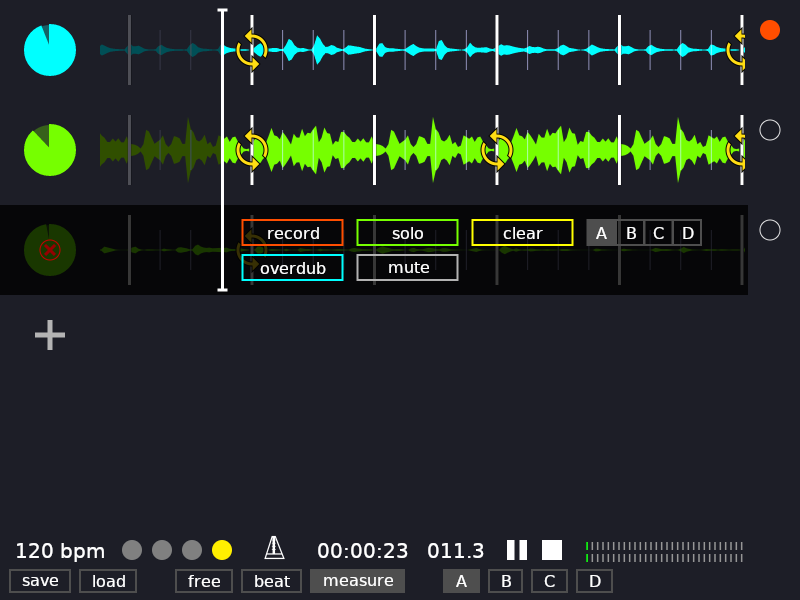
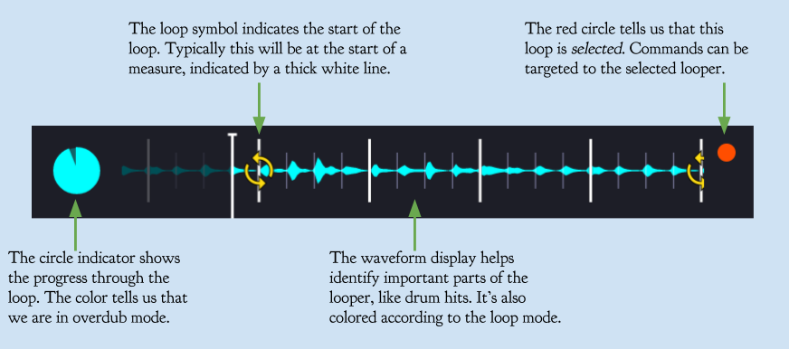
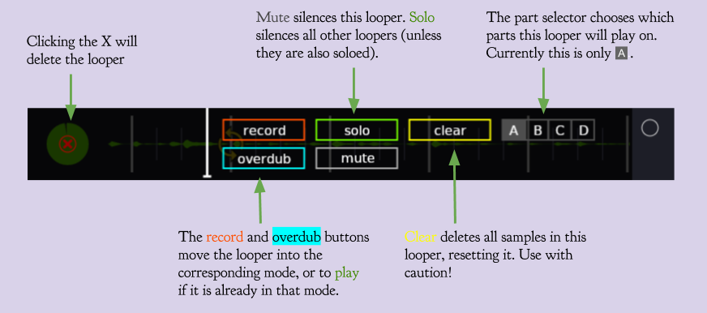

# Loopers

Loopers is graphical [live looper](http://www.livelooping.org/), written in Rust, designed for ease of use and 
rock-solid stability. It can be used as a practice tool, compositional aid, or for performing looped works in a live 
setting. 

Currently it runs only on Linux as a standalone [Jack](https://jackaudio.org/) application, which allows it to interface
with other Jack clients like effect racks, software instruments, and DAWs.

**INSERT GIF**

The system is modeled as a series of hardware loop units (like the Boss Loop Station) which are synchronized with
a single time control. The number of loop units is limited only by your display size, and loop lengths are limited only
by available memory.

## Features

* Multiple loops synchronized by a common time control
* Loops can be recorded to (setting loop length), overdubbed, cleared, muted, and soloed
* Up to four parts can be used to divide up portions of a performance
* Supports beat, measure, and free quantization of loop commands making it easy to keep things in sync
* Every operation can be controlled via the GUI or MIDI
* Sessions can be saved and restored
* A built-in metronome (on a separate Jack output) helps keep you in time with your loops
* No limitations on loop lengths aside from your computer's memory
* Cross-fading ensures a perfect loop, every time
* It's fun!

## Getting started

## Documentation

### UI Tour

The UI is divided into two parts: the top contains the set of loopers, while the bottom contains controls and settings
for the engine. Hovering over each looper shows controls for that looper, including setting the parts the looper is part
of and controlling the mode.

Each looper displays some key information to allow the performer to quickly understand its state:

Hovering over the looper produces controls for the looper (although most performers will prefer to use hardware buttons)

### Modes

### Settings

### Commands